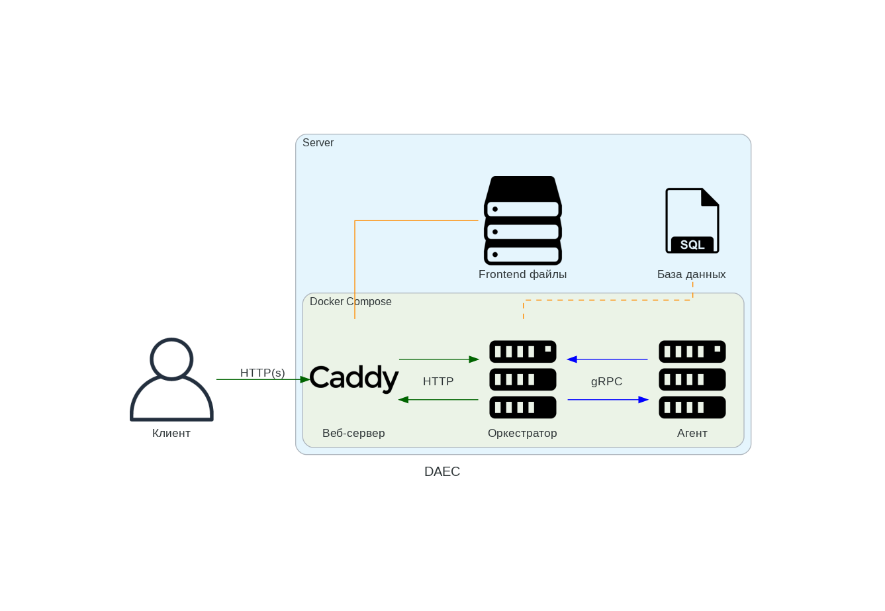

# DAEC

**D**istributed **A**rithmetic **E**xpression **C**alculator

Aka Распределенный вычислитель арифметических выражений.

> [!IMPORTANT]
> Это не полноценный проект, а всего-лишь решение на финальную задачу в Яндекс Лицее.
> Вся документация и комментарии в коде ведутся на русском языке.

<p align="center">
  <samp>
    Быстрая навигация
    <br>
    <a href="https://github.com/wavy-cat/DAEC/tree/main/examples">Примеры и тесты</a> · 
    <a href="https://github.com/wavy-cat/DAEC/tree/main/docs">API Reference</a>
  </samp>
</p>

## Архитектура проекта

Основные части приложения:

* Backend aka оркестратор
* Agent (демон) aka вычислитель
* Frontend (не имеет отдельного сервера) aka веб-интерфейс



Вычисления происходят в вычислителе, оркестратор лишь распараллеливает задачу и передаёт её частями агенту.
Также оркестратор хранит данные о задачах, выражениях и пользователях.

Оркестратор является многопользовательским.
Для работы с некоторыми эндпойнтами нужно быть зарегистрированным и предоставлять JWT токен.
Подробнее читайте в документации в [разделе "Авторизация"](docs/Authorization.md).

В качестве основного веб-сервера предлагается использовать [Caddy](https://caddyserver.com/).
Он уже присутствует в Docker Compose.

> [!NOTE]
> Текущая версия веб-интерфейса не адаптирована под многопользовательский режим.

### Терминология

* Выражение — любое мат. выражение, состоящее из неограниченного кол-ва операторов и операндов. Передаётся от клиента
  оркестратору.
* Задача — простое мат. выражение из одного оператора и двух операндов. Является частью Выражения. Передаётся от
  оркестратора агенту.

### Концепции клиента и агента

Общение оркестратора с клиентом:

* Происходит по HTTP (REST API с JSON).
* Идентификаторы имеют тип int64.
* Выражения и пользователи хранятся в SQLite.

Общение оркестратора с агентом:

* Происходит по gRPC (Protobuf).
* Идентификаторы имеют тип UUIDv4.
* Задачи хранятся в in-memory базе данных.

> При перезагрузке оркестратора незавершённые выражения отправляются заново на обработку.

## Что поддерживается

* Целочисленные числа
* Вещественные числа (разделяется через точку)
* Унарный минус (см. "Проблемы" пакета [postfix](backend/pkg/postfix/README.md))
* Операторы `+`, `-`, `*`, `/`, `^`
* Скобки

## Как запустить систему

### Запуск в Docker Compose

Для этого способа у вас должен быть установлен Git, Docker и Docker Compose.
Инструкции по установке Docker доступны на [официальном сайте](https://www.docker.com/get-started/). Можно также использовать Docker Desktop.

```bash
git clone https://github.com/wavy-cat/DAEC.git
cd DAEC
docker compose up -d
```

Для выключения:

```bash
cd DAEC # Если ещё не в папке с проектом
docker compose down
```

После запуска будет доступно API на http://localhost/api/v1/.
А веб-интерфейс на http://localhost.

Если вы хотите изменить адрес сервера, то отредактируйте [Caddyfile](Caddyfile).
А также [config.js](frontend/js/config.js) в веб-интерфейсе.

Время, требуемое для вычисления выражения из задачи, и computing power указываются в файле [.env](.env).

> [!NOTE]
> Иногда после запуска вы можете увидеть код ответа 502 Bad Gateway.
> В этом случае просто подождите, пока оркестратор запустится полностью.

### Запуск напрямую

В документации не будет описан. Используйте запуск через Docker.

Либо, можете попытаться запустить самостоятельно без инструкции.

## Остальная документация и примеры

Примеры (и по совместительству интеграционные тесты) находятся в папке [examples](examples).

*Нет, я серьёзно, интеграционные тесты написаны в .http файлах.*

Документация с API Reference и инструкциями по авторизации находятся в папке [docs](docs).

## Модульные тесты

Присутствуют в

* [pkg/postfix](backend/pkg/postfix/postfix_test.go) (100% Coverage)
* [pkg/queue](backend/pkg/queue/queue_test.go) (100% Coverage)
* [pkg/stack](backend/pkg/stack/stack_test.go) (100% Coverage)
